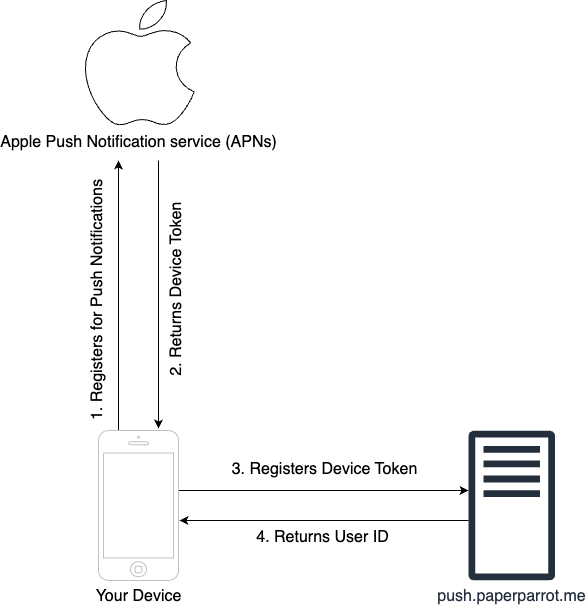
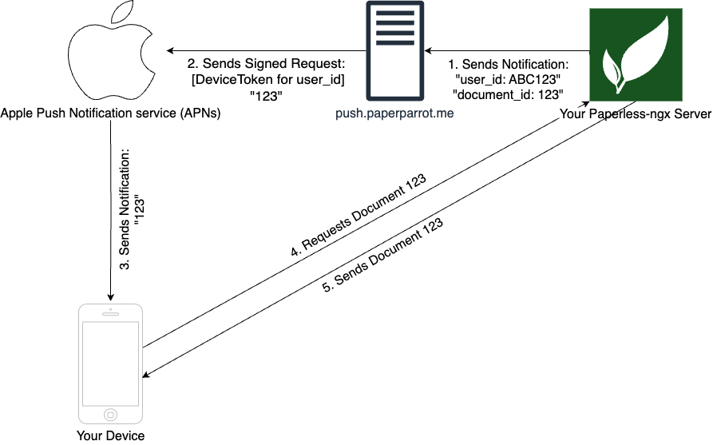

# Paperparrot Push Notification Service

This repository holds the server-side implementation of the Paperparrot push notification service.
Below, you'll find a graphic illustrating how this works. If you want to set up push notifications with your Paperless instance and Paperparrot, follow the [instructions here](https://paperparrot.me/docs/tutorial-advanced/push-notifications)

## How does this work?

### Registering for Notifications

No information regarding you or your server is transmitted to the Paperparrot push server.
The only information the Push server stores is the absolute minimum it needs to function:
- The randomly generated user ID
- The device tokens for all devices your register

**No other data about you, your device or your server is transmitted or stored!**

### Sending/Receiving Notifications

No information about your document other than the ID ever leaving your server. Once you tap the push notification on your device, Paperparrot will connect directly to your server to download the document and all other information.

## Security

The entire server implementation is built around keeping the amount of stored data at an absolute minimum.
If you find any security issues with push.paperparrot.me, please disclose them at support@paperparrot.me.

## Licensing

The Push service uses the following two libraries under their respective licenses:
https://github.com/ramsey/uuid
https://github.com/edamov/pushok

As of now, PaperparrotPush should be considered source-available. While you can see, download and fork this code, it is not licensed under any open source license.

If you want to use this implementation for a project or your own app, please let me know!